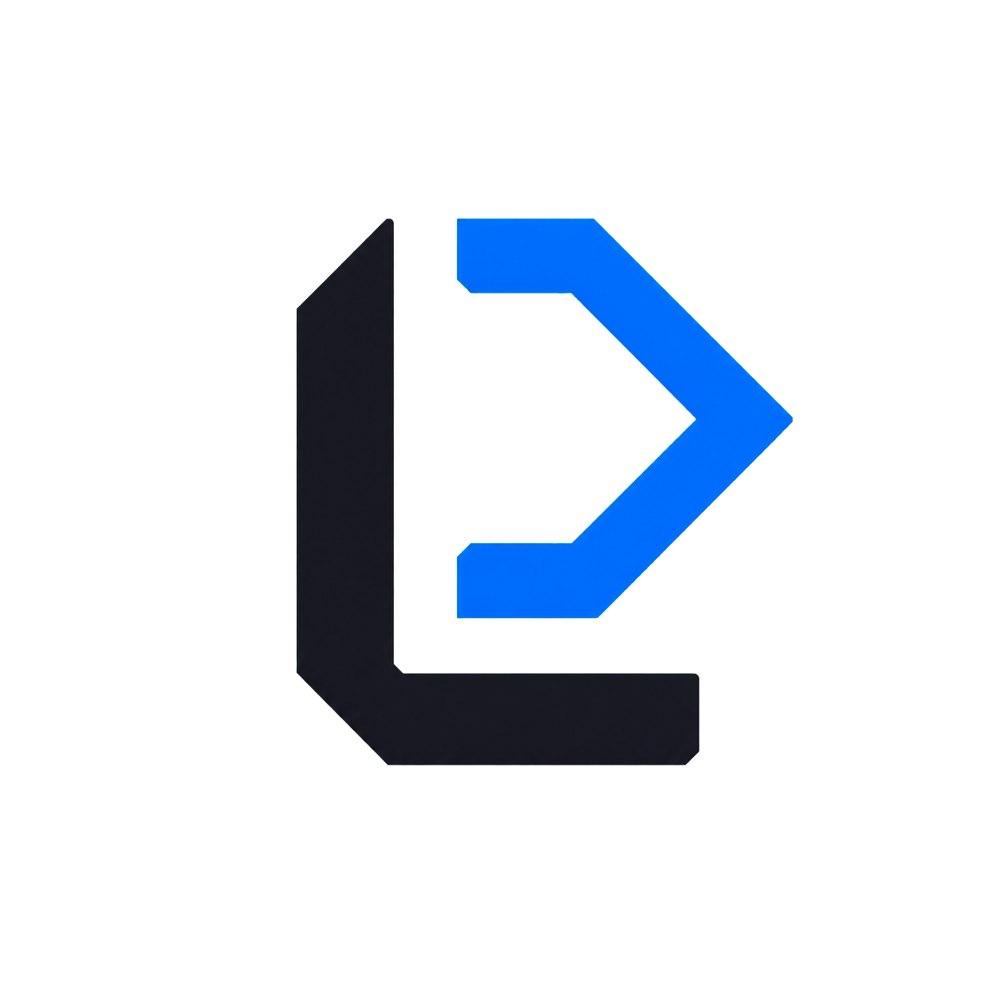

# Lan Code

<p align="center">
  
</p>

<p align="center">
  一个本地优先、模型无关、面向多客户端的通用 AI 编程 Agent。
</p>

<p align="center">
  <a href="https://github.com/zhaoxinyi02/lan-code/releases/latest">下载最新版</a>
  ·
  <a href="项目进度与交接.md">开发进度</a>
  ·
  <a href="docs/research-analysis.zh-CN.md">参考项目研究</a>
</p>

## Lan Code 是什么

Lan Code 希望把 AI 编程工具中最有价值的部分组合成一套可长期演进的系统：

- 像 Codex、Claude Code 一样理解仓库、执行工具、修改代码并运行验证。
- 像 Cline 一样让用户清楚看到权限、审批、工具调用和改动过程。
- 像 VS Code、Void 一样提供项目文件树、代码编辑器、Git 改动和行内补全。
- 像 OpenCode 一样让同一个 Core 服务桌面端、CLI、IDE 插件和 Web 客户端。
- 像 Kun 一样用统一能力路由组织文字、图片、语音以及未来更多媒体模型。

Lan Code 不绑定某一家模型服务。当前统一支持 OpenAI-compatible 接口，并预置
DeepSeek、OpenAI、OpenRouter、通义千问、Moonshot、Ollama 和自定义服务。


## 当前能力

### Agent 模式

- 真实 Agent 循环：模型提出工具调用，Core 负责权限判断与执行。
- 文件读取、搜索、创建、精确替换和多文件编辑。
- Git status、Git diff、命令执行与完整访问模式。
- `readOnly / ask / workspace / fullAccess` 四级权限。
- 审批暂停、允许、拒绝、任务中断与重复调用熔断。
- SQLite 持久化会话、消息、事件和 Token 用量。
- 可配置执行轮次，达到预算后生成收尾报告，而不是直接丢失任务结果。

### Code 模式

- 左上角可在 Agent 与 Code 工作台之间切换。
- 基于 VS Code 编辑器核心 Monaco 的代码编辑体验。
- 项目文件树、目录折叠、多标签编辑、脏文件提示与 `Ctrl+S` 保存。
- 新建文件/文件夹、重命名、删除和项目全文搜索跳转。
- Git 逐文件改动列表、diff 查看、确认后撤销未暂存改动，以及同一 Agent 对话侧栏。
- 内置 PowerShell 终端：仅在 `fullAccess` 下启用，每条命令执行前确认，120 秒超时且不弹黑色窗口。
- 手动 AI 补全与 Monaco 原生行内自动补全。
- 文件访问严格限制在当前工作区内。

### 模型与多模态能力

- 保存多套 Provider 配置档案并快速切换。
- API 测试同时验证文本响应、延迟和工具调用。
- 自动识别常见模型的图片输入、图片输出、语音输入和语音输出能力。
- 主模型支持能力时自动继承；不支持时可单独配置专用模型。
- 图片理解与图片生成已注册为 Core 工具，Agent 可根据任务主动调用，并经过外部副作用审批。
- 多模态路由已经为图片理解、图片生成、语音识别、语音输出预留统一结构。
- 输入、输出、缓存 Token 与预估费用统计。

### 桌面端与发布

- 默认数据目录为用户主目录下的 `~/.lancode`，也可自行选择。
- 项目添加、切换、移除；会话创建、恢复、重命名、搜索和删除。
- 从官方 GitHub Release 检查更新、下载安装包，并由用户确认后退出安装。
- Windows Release 提供 EXE 安装器、MSI 和便携 ZIP。
- 发布版不显示额外黑色终端窗口。

## 架构

```text
桌面端 / CLI / VS Code / JetBrains / Web
                  │
            lan-protocol
                  │
              lan-core
     ┌────────────┼────────────┐
  模型适配      Agent Loop     工具与权限
     │            │             │
 Provider     SQLite 事件     文件/Git/命令
```

| 目录 | 作用 |
| --- | --- |
| `crates/lan-protocol` | 跨客户端协议、会话、事件、审批和用量类型 |
| `crates/lan-core` | Agent loop、模型适配、工具、权限和持久化 |
| `crates/lan-daemon` | 面向未来多客户端的 JSONL 运行时边界 |
| `crates/lan-cli` | CLI 客户端 |
| `apps/desktop` | Tauri + React + Monaco 桌面端 |
| `research/repos` | Codex、Claude Code、VS Code、Kun 等参考仓库浅克隆 |

核心原则：

1. Agent 的真实状态属于 Core，不属于某个 UI。
2. 模型只能提出操作，权限和副作用由 Core 控制。
3. 客户端尽量保持薄，共享同一套会话、工具和事件协议。
4. 多模态能力通过统一路由解析，优先复用主模型，必要时回退到专用模型。
5. 默认保护用户文件，高风险操作必须显式授权。

## 快速开始

### 下载桌面端

从 [GitHub Releases](https://github.com/zhaoxinyi02/lan-code/releases/latest)
下载 Windows EXE、MSI 或便携 ZIP。

未签名安装包会触发 Windows SmartScreen，原因和正式签名方案见
[Windows 安装与签名](docs/Windows安装与签名.md)。

### 本地开发

需要 Rust、Node.js 和 Windows WebView2。

```powershell
git clone https://github.com/zhaoxinyi02/lan-code.git
cd lan-code

cargo test --workspace

cd apps/desktop
npm install
npm run tauri dev
```

### 运行 CLI

```powershell
Copy-Item lan.example.toml lan.toml
$env:DEEPSEEK_API_KEY = "你的 API Key"
cargo run -p lan-cli -- "阅读当前项目并解释架构"
```

CLI 的 API Key 只从环境变量读取。桌面端按当前产品决策将 API Key 明文保存到用户选择的
数据目录 `settings.json` 中，设置页面会明确提示风险。

## 验证与构建

```powershell
cargo fmt --all -- --check
cargo clippy --workspace --all-targets -- -D warnings
cargo test --workspace

cd apps/desktop
npm run build
npm run tauri build
```

构建 Windows 便携发布包：

```powershell
.\scripts\package-windows.ps1
```

## 安全边界

- 文件读写工具默认限制在当前工作区。
- 命令执行被标记为完全主机访问能力。
- `fullAccess` 会让 Agent 执行高风险命令，请只在可信项目中使用。
- 当前尚未实现真正的 Windows/Linux/macOS OS 沙箱。
- 不要提交或分享 `.lancode/settings.json`、API Key、Token、证书和签名私钥。

## 路线图

正在推进：

- 原生 Anthropic、Gemini 与更多 Provider 协议。
- 图片附件、图片生成工具、语音输入和语音输出。
- 完整工具输出、Git 改动审查、失败后继续执行。
- 项目/日期用量统计和任务耗时。
- Goal、Todo、Plan、Review、Fork 和上下文压缩。
- MCP、Skills、Hooks、插件和子 Agent。
- VS Code、JetBrains 与 Web 薄客户端。

完整进度和跨 Agent 交接信息见 [项目进度与交接.md](项目进度与交接.md)。

## 参考与许可

Lan Code 会研究 Codex、Claude Code、Cline、VS Code、Void、OpenCode、Kun、Aider 等项目的
产品和架构思想，但不会直接复制不兼容许可的实现。参考仓库仅用于研究，不作为 Lan Code
运行时依赖。

项目当前采用仓库中声明的许可。引入第三方代码或组件时必须保留其许可和归属信息。
