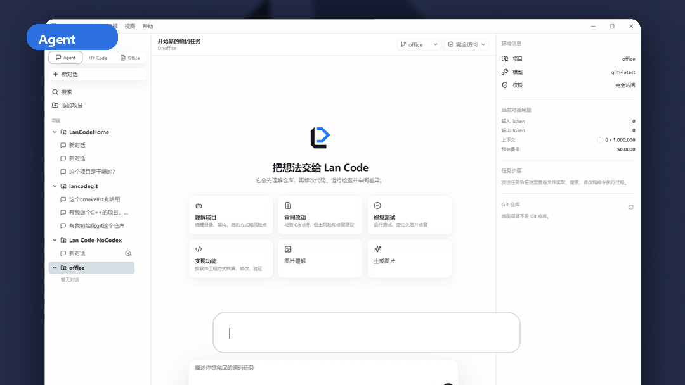
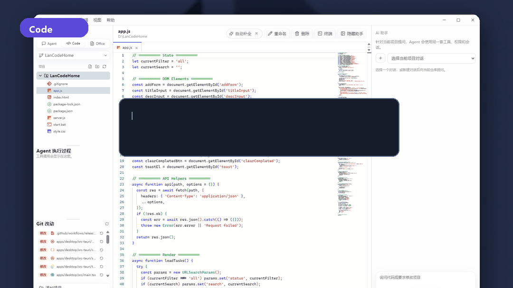
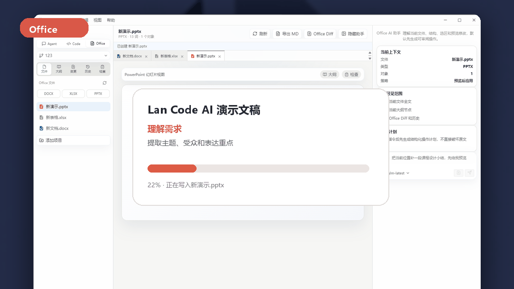

# Lan Code

<p align="center">
  
</p>

<p align="center">
  <strong>本地优先、模型无关、面向多客户端的 AI 编程与 Office Agent 工作台。</strong>
</p>

<p align="center">
  <a href="https://github.com/zhaoxinyi02/lan-code/releases/latest">下载最新版</a>
  ·
  <a href="docs/office-mode.zh-CN.md">Office Mode</a>
  ·
  <a href="docs/Office开源引擎与许可.md">Office 引擎</a>
  ·
  <a href="docs/architecture.md">架构说明</a>
  ·
  <a href="docs/research-analysis.zh-CN.md">参考项目研究</a>
  ·
  <a href="项目进度与交接.md">开发进度</a>
</p>

<p align="center">
  
</p>

## Lan Code 是什么

Lan Code 是一个正在快速迭代的 AI 工作台。它把 AI 编程 Agent、代码编辑器、终端、Git 审查、多模型路由、图片能力和 Office 文件处理放在同一个产品里。

它借鉴了 Codex、Claude Code、Cline、OpenCode、Void、VS Code、Kun、Aider 等项目的优秀思路，但目标不是复制其中任何一个，而是做一个更通用的本地 AI Agent Core：

- 不绑定单一模型厂商。
- 不只服务一个客户端。
- 不把 UI 状态当作 Agent 状态。
- 不让模型直接执行高风险副作用。
- 不把 Office 文件当成普通二进制附件，而是作为可审阅、可回滚、可结构化修改的工作对象。

## 亮点

### Agent 模式

<p align="center">
  
</p>

- 真实 Agent 循环：模型提出工具调用，Core 执行权限判断、工具运行和事件持久化。
- 支持文件读取、搜索、创建、精确替换、多文件编辑、Git status、Git diff、命令执行。
- `readOnly / ask / workspace / fullAccess` 四级权限。
- 工具调用过程可视化，失败、完成、执行中状态清楚展示。
- 支持任务中断、审批、重复调用保护、Token 用量和费用估算。

### Code 模式

<p align="center">
  
</p>

- Monaco 编辑器，多标签、预览标签、脏文件提示、`Ctrl+S` 保存。
- 文件树、文件图标、目录折叠、新建、重命名、删除、项目切换。
- Git 改动、工作区状态、提交记录和逐文件 diff。
- 集成 PowerShell / CMD / WSL 终端，后台执行，不弹黑窗口。
- 行内 AI 自动补全，按 Tab 接受。
- 同一套 Agent 侧栏理解当前仓库。

### Office Mode

<p align="center">
  
</p>

Office Mode 是 Lan Code 的新工作台：让 AI 像处理代码一样处理 `.docx`、`.xlsx`、`.pptx` 和后续更多办公文件。

当前已经具备：

- Office 文件扫描和多文件 Tab。
- DOCX 原始页面版式渲染、页眉页脚、批注和分页。
- XLSX 内嵌 Univer 表格编辑器，支持单元格、公式和多工作表编辑保存。
- PPTX 原始幻灯片 Canvas 渲染和翻页预览。
- 文档字体、字号、粗体、斜体、下划线等基础格式工具。
- 左侧文件、大纲、变更、历史、检查面板。
- 中间文档/表格/幻灯片工作区。
- 右侧 Office AI 助手和上下文卡片。
- 结构化 `OfficeAction`、Office Diff、备份、应用和回滚。
- Office 文件导出为 Markdown，方便审阅和继续交给 Agent。

详细说明见 [Office Mode 文档](docs/office-mode.zh-CN.md)。

### 多模型与多模态

- 同时保存多套模型配置，在输入框直接切换。
- 支持 OpenAI-compatible Provider，并内置 DeepSeek、OpenAI、Anthropic、Gemini、OpenRouter、通义千问、Moonshot、火山方舟、MiniMax、Ollama、LM Studio 等常见服务入口。
- 已支持原生 Anthropic Messages API。
- 模型测试会检查延迟、文本响应和工具调用能力。
- 图片理解、图片生成、语音识别、语音输出预留统一能力路由。

## 截图


## 架构

```text
桌面端 / CLI / VS Code / JetBrains / Web
                  │
            lan-protocol
                  │
              lan-core
     ┌────────────┼────────────┐
  模型适配      Agent Loop     工具与权限
     │            │             │
 Provider     SQLite 事件     文件/Git/命令/Office
```

| 目录 | 作用 |
| --- | --- |
| `crates/lan-protocol` | 跨客户端协议、会话、事件、审批和用量类型 |
| `crates/lan-core` | Agent loop、模型适配、工具、权限和持久化 |
| `crates/lan-daemon` | 面向未来多客户端的 JSONL 运行时边界 |
| `crates/lan-cli` | CLI 客户端 |
| `apps/desktop` | Tauri + React + Monaco 桌面端 |
| `docs` | 中文文档、架构说明、Office Mode 说明和截图 |
| `research/repos` | Codex、Cline、OpenCode、Kun 等参考仓库浅克隆 |

核心原则：

1. Agent 的真实状态属于 Core，不属于某个 UI。
2. 模型只能提出操作，权限和副作用由 Core 控制。
3. 客户端尽量保持薄，共享同一套会话、工具和事件协议。
4. 多模型和多模态能力通过统一路由解析。
5. 高风险操作必须可见、可审阅、可回滚。

## 下载

从 [GitHub Releases](https://github.com/zhaoxinyi02/lan-code/releases/latest) 下载：

- Windows EXE 安装器
- Windows MSI 安装包
- 便携 ZIP 包

当前安装包未做商业代码签名，Windows SmartScreen 可能提示“未知发布者”。说明见 [Windows 安装与签名](docs/Windows安装与签名.md)。

## 本地开发

需要 Rust、Node.js 22+ 和 Windows WebView2。

```powershell
git clone https://github.com/zhaoxinyi02/lan-code.git
cd lan-code

cargo test --workspace

cd apps/desktop
npm install
npm run tauri dev
```

## 构建

```powershell
cargo fmt --all -- --check
cargo test --workspace

cd apps/desktop
npm run build
npm run tauri build
```

构建 Windows 便携包：

```powershell
.\scripts\package-windows.ps1
```

## 安全边界

- 文件读写默认限制在当前工作区。
- 命令执行属于高风险能力，只有 `fullAccess` 模式才允许。
- 当前还没有真正 OS 级沙箱，请只在可信项目中启用完全访问。
- 桌面端按当前产品决策将 API Key 明文保存到用户数据目录 `~/.lancode/settings.json`。
- 不要提交或分享 `.lancode/settings.json`、API Key、Token、证书和签名私钥。

## 路线图

- Office Mode：页面渲染、真实光标/选区同步、单元格/幻灯片对象级操作、视觉 Diff。
- Core：更强上下文压缩、任务恢复、失败续跑、多 Agent 协作。
- 模型：原生 Gemini、更多非 OpenAI-compatible 协议和自动能力识别。
- 客户端：VS Code 插件、JetBrains 插件、Web 客户端。
- 插件：MCP、Hooks、Skills、项目级自动化。

完整进度和跨 Agent 交接信息见 [项目进度与交接.md](项目进度与交接.md)。

## 许可

Lan Code 会研究优秀开源 AI 编程工具的产品和架构思想，但不会直接复制不兼容许可的实现。引入第三方代码或组件时必须保留其许可和归属信息。

项目当前采用仓库中声明的许可。
