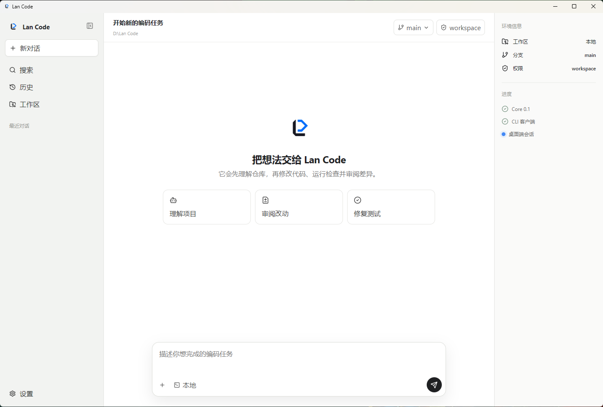

# Lan Code

Lan Code is an AI coding-agent core designed to serve multiple clients:
desktop, CLI, VS Code, JetBrains, and web.

Version 0.1 ships a Rust agent core, an interactive CLI, a JSONL daemon for
future clients, and a Tauri desktop application.



The first milestone is deliberately small:

- `lan-protocol`: stable, serializable client/core contracts
- `lan-core`: sessions, event stream, tool registry, and permission policy
- `lan-daemon`: newline-delimited JSON over stdio

Research checkouts live under `research/repos/` and are not dependencies of Lan
Code.

## Try it

```powershell
cargo test --workspace
'{"id":"1","method":"initialize","params":{"client":{"name":"manual","version":"0.1"}}}' |
  cargo run -q -p lan-daemon
```

See `docs/architecture.md` and `docs/research-analysis.zh-CN.md`.
The concrete 0.1 release gate is documented in `docs/roadmap-0.1.md`.

Build a Windows release bundle with:

```powershell
.\scripts\package-windows.ps1
```

Run the interactive CLI:

```powershell
cargo run -p lan-cli
```

Run the desktop client:

```powershell
cd apps/desktop
npm install
npm run tauri dev
```

## Ask DeepSeek about the current workspace

```powershell
Copy-Item lan.example.toml lan.toml
$env:DEEPSEEK_API_KEY = "..."
cargo run -q -p lan-cli -- "Read the project and explain its architecture"
```

The API key is read only from the environment variable named by
`provider.api_key_env`; never put the secret in `lan.toml`. Set
`approval_mode = "workspace"` only when you intend to allow bounded workspace
edits through `replace_text`, `create_file`, and `apply_edits`.
`run_command` is classified as full host access and requires
`approval_mode = "fullAccess"`. Existing `DEEPSEEK_MODEL`, `LAN_DATABASE`, and
`LAN_APPROVAL_MODE` environment variables remain supported as overrides.
Until OS sandboxing lands, command execution additionally requires
`LAN_ALLOW_UNSANDBOXED_COMMANDS=1` as an explicit acknowledgment that the
process has full host authority.
