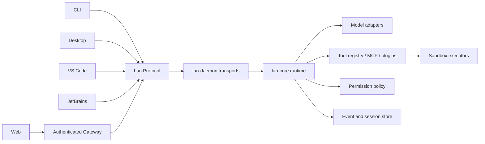

# Lan Code Core Architecture

## Product boundary

Lan Code core is a local-first agent runtime, not a UI component. Every client
connects through a versioned protocol and should be replaceable without changing
agent behavior.

## Non-negotiable boundaries

1. Protocol types contain no UI framework or provider SDK types.
2. Model adapters never execute tools directly.
3. Tool definitions declare risk; policy decides; executors enforce.
4. Durable events and ephemeral streaming deltas are distinct.
5. Workspace containment is enforced below the tool layer.
6. Remote/web clients never receive raw host authority.

## Planned crates

- `lan-protocol`: wire types and generated client schemas.
- `lan-core`: turn loop, context assembly, session coordination, tools, policy.
- `lan-store`: SQLite event log, projections, checkpoints, migrations.
- `lan-models`: OpenAI-compatible, Anthropic, Gemini, local model adapters.
- `lan-tools`: built-in filesystem, search, patch, shell, git, browser tools.
- `lan-sandbox`: OS-specific execution and network/filesystem enforcement.
- `lan-mcp`: MCP client/server bridge.
- `lan-daemon`: stdio, local socket, and authenticated HTTP/WebSocket transports.
- client SDKs generated from `lan-protocol`.

## Protocol lifecycle

The current JSONL transport implements:

- `initialize`
- `session/create`
- `session/list`
- `tool/list`
- `tool/call`
- `turn/start`

The core currently has an OpenAI-compatible provider, a bounded 12-round agent
loop, provider-native reasoning replay, read-only workspace tools, and one
optimistic `replace_text` workspace-write tool.

SQLite persistence stores session snapshots, model-visible message history, and
ordered durable core events. Sessions left running or waiting for approval when
the process exits are restored as interrupted; side effects are never silently
replayed.

The daemon concurrently serves long-running requests and implements:

- `turn/interrupt`
- `approval/list`
- `approval/resolve`
- `session/events`
- live `event` notifications on the same JSONL connection

The next protocol slice should add capability negotiation, schema export, and
durable approval continuation across clients.
